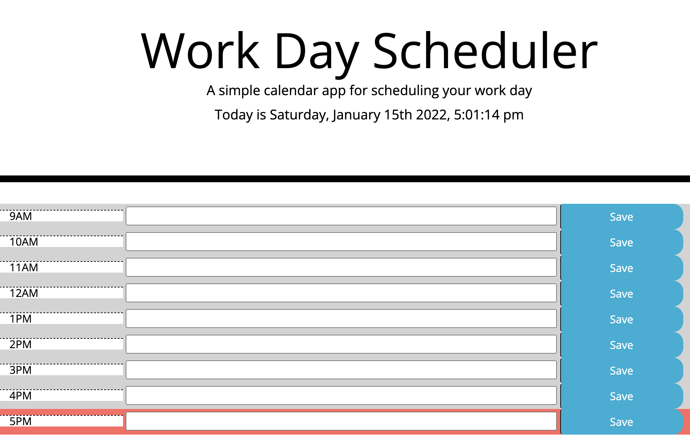

# Work Day Scheduler (calendar-app)

## Description
This project contains a Work Day Scheduler that will allows a user to capture the events they have planned for each hour of the work day.

## Built with
* HTML
* CSS
* JavaScript
* jQuery
* Moment.js

## Features
* Current time displayed at the top of the page
* Colour coded time blocks, indicating whether its in the past, present or future 
* Events saved to local storage, making them available after the page is refreshed or closed
* Mobile responsive layout

## Getting started
### Installation
The responsitory is available for cloning [in Github](https://github.com/RachelHarris90/calendar-app).

### Usage
The website can be viewed [in Github pages](https://rachelharris90.github.io/calendar-app/).

## Credits
The author of this repository is Rachel Harris, a student of University of Sydney Fullstack Developer Bootcamp. 

## License
None.

## Tests
This code is not currently covered with automated tests.